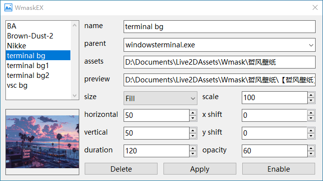

# WmaskEX

**Live wallpaper for any window**

[](https://www.microsoft.com/windows) [](https://isocpp.org/)

## ✨ Key Features

- 🚀 **Ultra-lightweight**: GUI built with pure Win32 API for instant startup
- 🔒 **Completely portable**: No hooks, no registry modifications, 100% clean
- ⚡ **Minimal resource usage**: Optimized for maximum performance
- 🎭 **Multi-version Spine support**: Compatible with Spine 3.7, 3.8, 4.0, 4.1, 4.2
- 🎯 **Smart application targeting**: Match and attach overlays by application name (e.g., explorer.exe)
- 🎨 **Dynamic responsive layout**: Adaptive positioning that responds to window size changes
- 🔄 **Automatic random cycling**: Random switching between multiple assets

## ⚙️ Configuration Reference



| Parameter  | Description          | Type        | Details                                                      |
| ---------- | -------------------- | ----------- | ------------------------------------------------------------ |
| name       | Configuration Name   | String      | Unique identifier for the configuration                      |
| parent     | Parent Window        | String      | Target parent window process name (e.g., `explorer.exe`)     |
| assets     | Assets Folder        | Path        | Directory containing overlay assets                          |
| preview    | Preview Image        | Path        | Preview image file path                                      |
| size       | Size Adaptation Mode | Enum        | Fill / Fit / Follow Height / Follow Width / Fixed Size       |
| scale      | Scale Percentage     | Number (%)  | Scaling factor applied after size adaptation                 |
| horizontal | Horizontal Position  | Number (%)  | Horizontal position within parent window (0-100+)<br/>0/100 = left/right edge alignment |
| x shift    | Horizontal Offset    | Number (px) | Horizontal pixel offset                                      |
| vertical   | Vertical Position    | Number (%)  | Vertical position within parent window (0-100+)<br/>0/100 = bottom/top edge alignment |
| y shift    | Vertical Offset      | Number (px) | Vertical pixel offset                                        |
| duration   | Cycle Duration       | Time (sec)  | Asset switching interval                                     |
| opacity    | Opacity              | Number      | Display opacity (0-255)                                      |

## 📁 Asset Management

### 🖼️ Image Assets

WmaskEX searches for image files **only in the top-level directory** (non-recursive) with the following extensions (case-insensitive):
- **Supported formats**: `png`, `jpg`, `jpeg`, `bmp`, `ico`, `tiff`, `exif`, `wmf`, `emf`

### 🎭 Spine Animation Assets

WmaskEX **recursively searches** for Spine animations by detecting `.atlas` files and checking for matching skeleton files:

**Required files for Spine detection:**
- ✅ `.atlas` file (texture atlas)
- ✅ `.json` or `.skel` file (skeleton data) with **same filename**

**Configuration Priority:**
1. 🎯 **Manual configuration**: `.wmaskex.json` with **same filename** (if present, takes precedence)
2. 🤖 **Auto-parsing**: Direct parsing from skeleton and atlas files

#### Auto-parsing Behavior

When no `.wmaskex.json` is found, WmaskEX automatically:
- 📊 **Version detection**: Extracts Spine version from `.skel` or `.json` files
- 📐 **Bounds calculation**: Reads skeleton bounds (x, y, width, height)
- 🎨 **PMA detection**: Parses premultiplied alpha setting from `.atlas` file

#### Manual Configuration Example

`.wmaskex.json` (optional, overrides auto-parsing):

```json
{
    "version": "3.8", 
    "bounds": [-100, -10, 220, 450], 
    "pma": true
}
```

**Bounds Format**: `[x, y, width, height]`
- `width`, `height`: Bounding box dimensions
- `x`, `y`: Bottom-left corner coordinates

## 🛠️ Installation & Setup

### System Requirements
- Windows 7/8/10/11 (64-bit)
- Visual C++ Redistributable
- OpenGL support

### Quick Start
1. Download the latest release
2. Extract to your preferred directory
3. Run `WmaskEX.exe`
4. Configure your overlays through the GUI
5. Enjoy your enhanced desktop experience!

### Building from Source

```powershell
# Install dependencies with vcpkg
vcpkg install nlohmann-json glbinding

# Clone and build
git clone https://github.com/wang606/WmaskEX.git
cd WmaskEX
mkdir build && cd build
cmake ..
cmake --build . --config Release
```

## 🎮 Gallery


---

**⭐ Star this project if you find it useful! ⭐**

