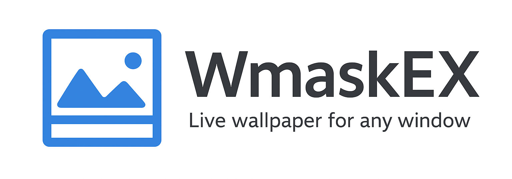
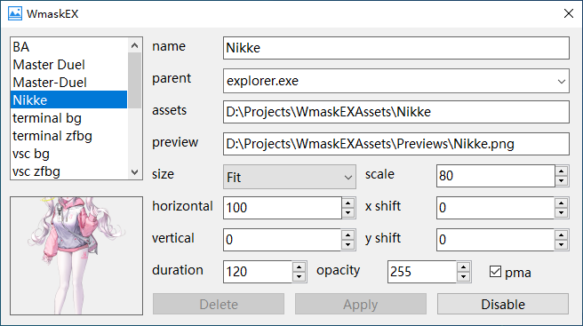
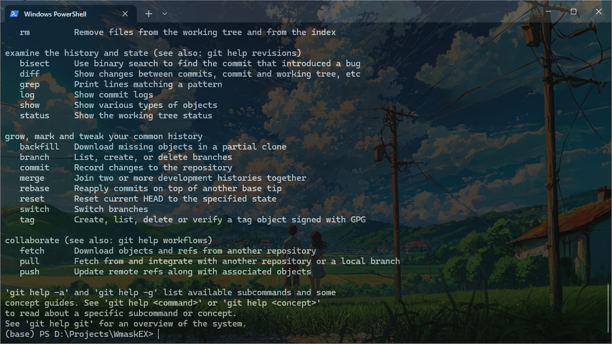
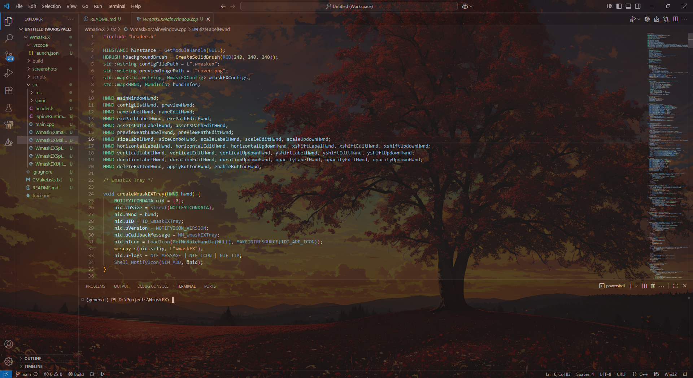

## 应用特点

- GUI采用win32 api编写，超轻量启动！
- 不依赖hook，不写注册表，纯净便携
- 极低资源占用
- spine支持版本：3.7,3.8,4.0,4.1,4.2

## 配置说明



| 配置名称   | 中文解释       | 数据类型     | 配置说明                                                     |
| ---------- | -------------- | ------------ | ------------------------------------------------------------ |
| name       | 名称           | 字符串       | 用于标识配置，应唯一                                         |
| parent     | 父窗口         | 字符串       | 代表需要匹配的父窗口程序名称，如`explorer.exe`；             |
| assets     | 素材文件夹     | 路径         | 素材所在文件夹                                               |
| preview    | 预览图         | 路径         | 预览图文件路径                                               |
| size       | 尺寸适应方式   | 枚举         | 【填充】【适合】【跟随高度】【跟随宽度】【固定大小】         |
| scale      | 尺寸缩放百分比 | 数字（%）    | 在尺寸适应确定大小之后进行缩放                               |
| horizontal | 水平位置       | 数字（%）    | 素材在父窗口水平方向的位置，取值不限于0-100<br />0/100分别代表素材左/右边框和父窗口左/右边框重合 |
| x shift    | 水平偏移       | 数字（像素） | 水平方向像素偏移值                                           |
| vertical   | 垂直位置       | 数字（%）    | 素材在父窗口垂直方向的位置，取值不限于0-100<br />0/100分别代表素材下/上边框和父窗口下/上边框重合 |
| y shift    | 垂直偏移       | 数字（像素） | 垂直方向像素偏移值                                           |
| duration   | 周期           | 时间（秒）   | 更换素材的周期                                               |
| opacity    | 不透明度       | 数字         | 素材显示的不透明度，取值0-255                                |

## 素材说明

WmaskEX会递归搜索素材文件夹下所有后缀为“png,jpg,jpeg,bmp,ico,tiff,exif,wmf,emf“（不区分大小写）的文件作为图像素材，并将所有符合条件的文件夹作为Spine素材，后者符合条件的含义为：该文件夹下存在同名.atlas文件，存在同名.json或同名.skel文件，存在同名.wmaskex.json或同名.wmaskex.autogen.json文件。

.wmaskex.json或.wmask.autogen.json（由WmaskEX自动化生成的）示例：

```json
{
    "version": "3.8", 
    "bounds": [-100, -10, 220, 450], 
    "pma": true
}
```

bounds（x, y, width, height）中width和height为定位框的宽带和高度，x和y则是定位框左下角坐标。WmaskEXSpineConfigAutoGenerator自动生成时，将采用所有动画最大边界框作为定位框。

## 注意事项

- 对于图片，直接放在文件夹里面就行，WmaskEX会递归搜索；
- 图片支持格式：png/jpg/jpeg/bmp/ico/tiff/exif/wmf/emf

- **对于Spine动画，atlas和skel或json文件需要与所在文件夹同名，且该文件夹下必须有同名的.wmaskex.json或.wmaskex.autogen.json文件才能正确识别到Spine素材；**
- 支持的Spine版本：3.7/3.8/4.0/4.1/4.2

# 画廊






